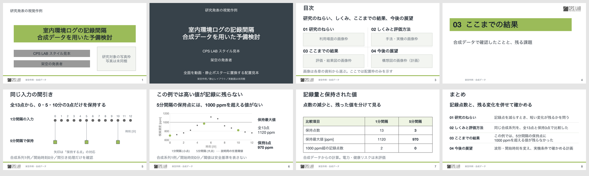
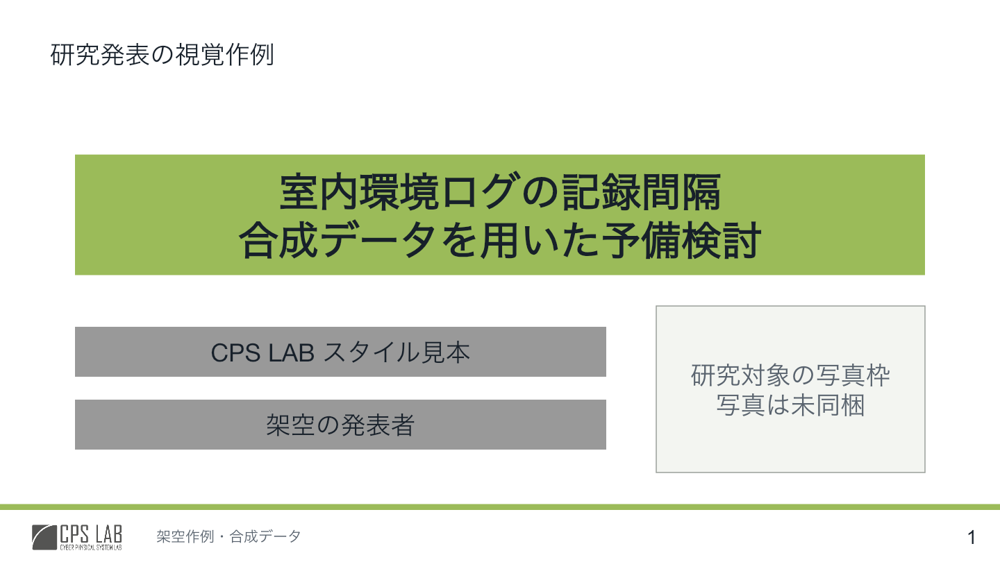
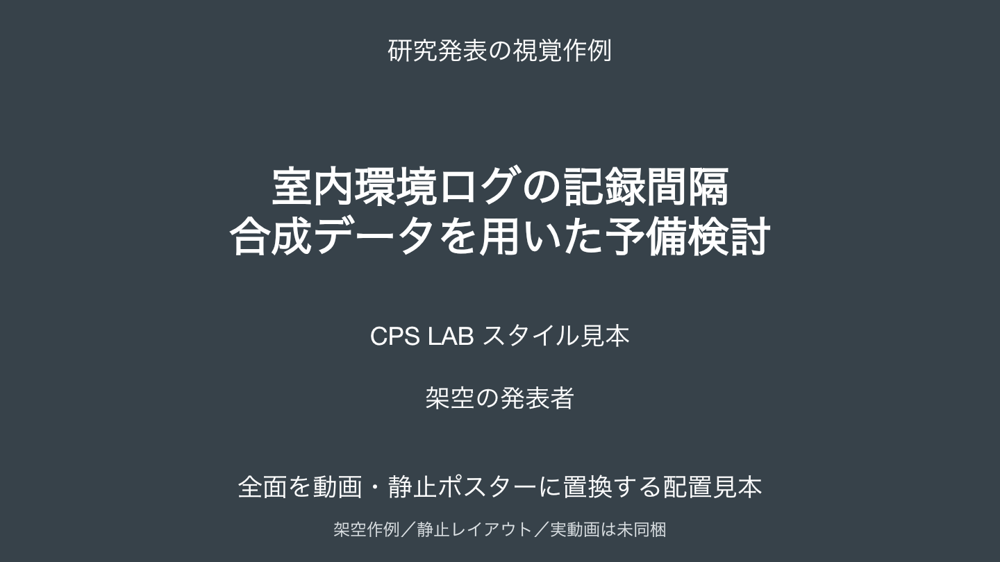
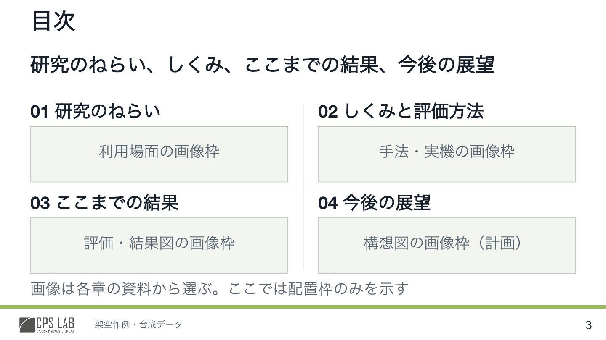
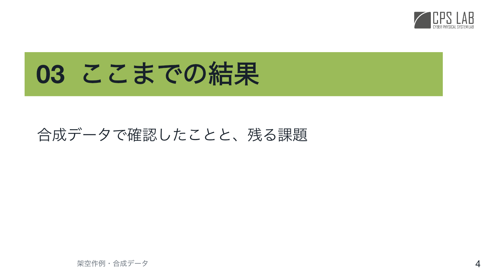
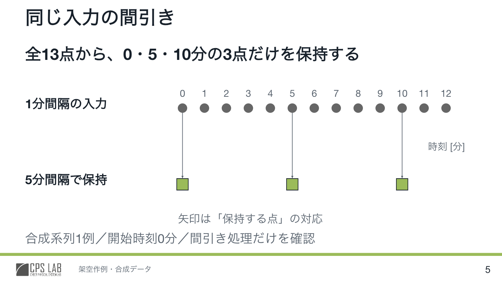
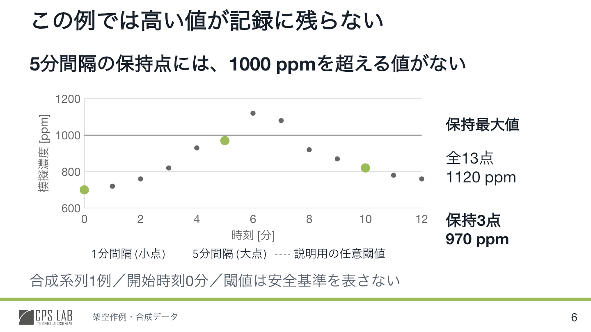
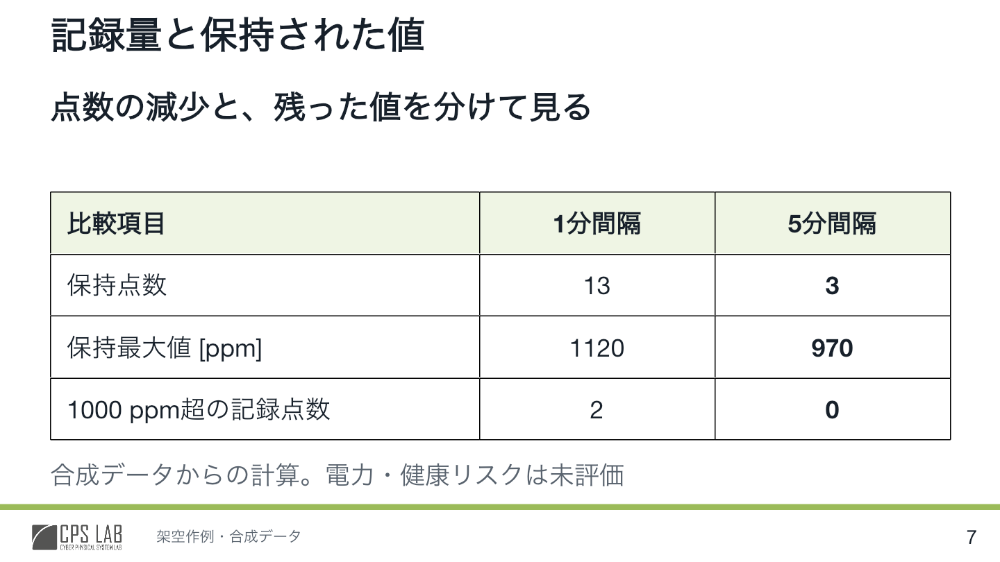
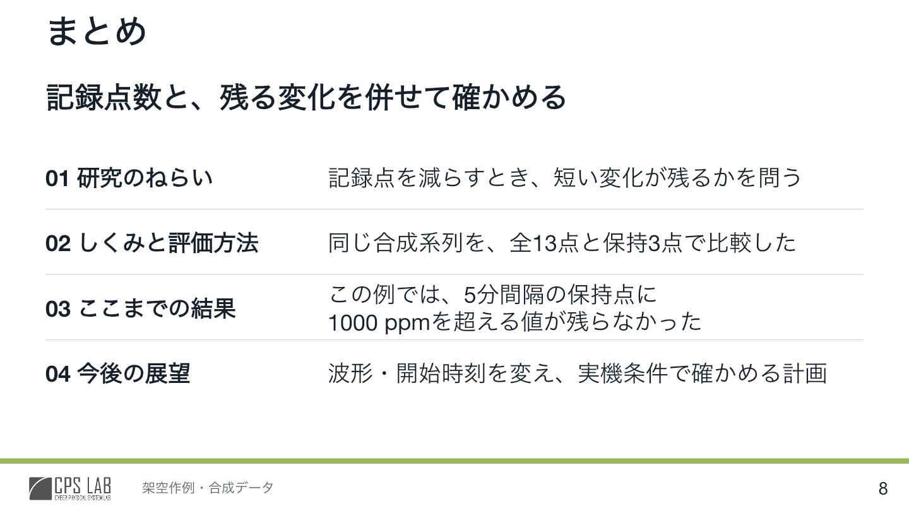

# 研究発表スライド制作スキル

学会・研究会・学内での研究発表を、対話しながら編集可能なPowerPointへ仕上げるCodex用スキルです。

**スタイル → 企画書 → アウトライン → スライド構成と図 → 完成イメージ → 編集可能なPPTX**

構成と本文デザインは**中間発表型**を標準とし、表紙だけ**FIT2026型（題目帯＋写真）／中間発表型（背景動画）**から選べます。

各工程の成果物を確認しながら進められます。「企画書だけ」「構成から再開」「既存PPTXの改訂」にも使えます。作成者の過去チャットや研究リポジトリは必要ありません。

## 作例

同梱の8枚は、**架空研究・合成データによるレイアウト見本**です。表紙2種類と共通の本文デザインをまとめて確認できます。実際の発表では表紙をどちらか一方選びます。8枚という枚数は、発表の推奨枚数ではありません。



[編集可能な見本PPTX](assets/visual-reference/cps-layout-reference.pptx) · [作例の説明と検証範囲](references/visual-reference.md) · [企画から図までの通し作例](references/worked-example.md)

<details>
<summary>作例を1枚ずつ見る（全8枚）</summary>

### 1. FIT2026型の表紙

題目帯、所属・発表者帯、研究対象の写真を組み合わせる表紙です。見本の写真部分は配置枠です。



### 2. 中間発表型の表紙

全画面の背景に白文字を重ねる表紙です。見本は静止レイアウトで、背景動画は同梱していません。



### 3. 画像付き2×2目次

4章と各章の画像を対応させます。見本の画像部分は配置枠です。



### 4. 上部型の章扉

上部の色帯に章番号と章名を置き、その下に案内文を添えます。



### 5. 模式図

上部に話題とメッセージ、下部に主図を配置します。PPTXでは点・接続線・文字を個別に編集できます。



### 6. 定量図

軸・単位・系列・条件注記を示す散布図です。PPTXには編集可能なチャートとデータを収録しています。



### 7. 比較表

条件ごとの値を、単位を付けた表で比較します。PPTXでは表のセルを編集できます。



### 8. 縦4行のまとめ

目次と同じ章名・順序で、各章の要点を振り返ります。



</details>

実際の成果物は利用者の研究プロジェクトへ保存します。このリポジトリには、再利用するスキル・素材・ひな形と、明示した架空作例を収録しています。

## 導入

Codexが使える環境で、次を実行します。既に同名のスキルを導入している場合は、[更新について](#更新について)を確認してください。

```sh
git clone https://github.com/gomadoufu/research-presentation-slides.git \
  "$HOME/.agents/skills/research-presentation-slides"
```

Gitを使わない場合は、このリポジトリの **Code → Download ZIP** からダウンロードし、展開したフォルダ名を `research-presentation-slides` に変更して、ホームフォルダの `.agents/skills/` に置きます。

最終的な配置は次のとおりです。`SKILL.md` だけでなく、フォルダ全体を配置してください。

```text
~/.agents/skills/research-presentation-slides/
├── SKILL.md
├── agents/
├── assets/
├── references/
└── scripts/
```

研究プロジェクト内だけで使う場合は、代わりにそのプロジェクトの `.agents/skills/research-presentation-slides/` に置けます。個人用とプロジェクト用のどちらかを選びます。認識されない場合はCodexを再起動してください。[公式のスキル導入案内](https://learn.chatgpt.com/docs/build-skills)

## 使い方

研究資料があるプロジェクトをCodexで開き、チャット欄に次を送ります。論文や実験結果を添付するか、ファイルの場所を指定してください。

```text
$research-presentation-slides

中間発表型の構成・本文デザインで、学会の10分発表を作りたい。
表紙はFIT2026型にして。
聴衆は情報工学系の学生・研究者。質疑は別に5分。
添付した論文と実験結果を今回の正本として使って。
編集可能なPPTXまで作りたい。
まずスタイルと企画書から、各段階で相談しながら進めて。
```

中間発表型の表紙にしたい場合は「表紙は中間発表型。背景動画は○○」と指定します。表紙が未指定なら2択で確認します。本文はどちらも、画像付き2×2目次・4章・上部型章扉・縦4行のまとめを基本にします。

分かる情報だけで始められます。Codexが資料から[入力票](assets/input-brief.org)を整理し、次の判断に必要な不足を確認します。既存のスタイルを使う場合は、その資料も渡してください。

途中から再開する場合の例：

```text
$research-presentation-slides
企画書とスタイルは確認済みです。添付した制作記録を読んで、
今日はアウトラインとスライド構成まで進めて。
```

## 必要な環境

- ファイルを読み書きできるCodex環境。
- 完成イメージの生成には画像生成ツール。
- PPTX制作には編集可能なPPTXの制作・編集ツールと、全ページを画像化して確認する機能。
- CPSスタイルの基本フォントは `Noto Sans JP`。フォント自体は同梱していません。

`Presentations`、`imagegen` が使える環境ではそれぞれの現行手順に従います。このリポジトリを配置するだけで、ツール・権限・フォントが追加されるわけではありません。詳しくは[導入と実行条件](references/sharing.md)を参照してください。

## 共通の品質基準と見本

研究内容は各メンバーの資料に基づき、根拠・論理・可読性・編集可能性を同じ[完成基準](references/quality-standard.md)で確認します。生成文章や画像の完全一致を要求するものではありません。

| 資料 | 用途 |
|---|---|
| [スキル本体](SKILL.md) | 6工程と対話・再開の手順 |
| [CPSスタイル](references/cps-lab-style.md) | 色、余白、文字階層、ロゴ配置 |
| [通し作例](references/worked-example.md) | 根拠から企画書、メッセージ、図へ変換する具体例 |
| [編集可能な見本PPTX](assets/visual-reference/cps-layout-reference.pptx) | 表紙2種類、目次、章扉、模式図、定量図、表、まとめの8種類 |
| [視覚作例の説明](references/visual-reference.md) | 比較ポイント、検証範囲、再生成方法 |
| [検証記録のひな形](assets/quality-review.org) | 確認結果と未検証事項の記録 |

見本の研究・データは架空です。実際の研究結果として使用しないでください。見本の表紙・目次には未提供素材の配置枠があり、中間型表紙の実動画は同梱していません。見本PPTXは構造検査と全8枚のレンダー確認済みです。PowerPoint本体での編集・再保存は未検証で、描画エンジンによる表示差も[作例の説明](references/visual-reference.md)に記録しています。

## 補助スクリプト

Python標準ライブラリだけで動きます。制作記録の初期化は任意で、通常はCodexが必要に応じて実行します。

```sh
python3 scripts/init_presentation.py --project-dir /path/to/presentation --title '研究発表'
python3 scripts/check_pptx.py assets/visual-reference/cps-layout-reference.pptx --expect-slides 8
```

初期化スクリプトは既存の制作記録を上書きしません。PPTX検査はZIP・XML・参照・要素構造の確認であり、目視確認の代わりにはなりません。

## 更新について

Gitで導入し、ローカルでファイルを変更していない場合は、導入先で `git pull --ff-only` を実行します。独自の変更がある場合は、差分を保存してから更新内容を統合してください。

同名の旧スキルが `.codex/skills/` などにある場合は、必要な旧版を検索対象外へ保存し、使用する版を1つにします。既存ファイルを無条件で上書きしないでください。

## 同梱ファイルの管理

現在のスキル版は **1.2.0** です。[package-manifest.json](package-manifest.json)にはスキルの配布ファイルとSHA-256、見本の検証範囲を記録しています。リポジトリ運用用のREADME・Git設定等はこの一覧の対象外です。

PNG・PPTXは、メンバーが制作環境なしでも見本を確認できるよう同梱しています。合成入力は [example-source.org](assets/example-source.org)、生成コードは [build.mjs](assets/visual-reference/build.mjs)、再生成手順は[視覚作例の説明](references/visual-reference.md)にあります。フォントや制作エンジンは同梱していません。
